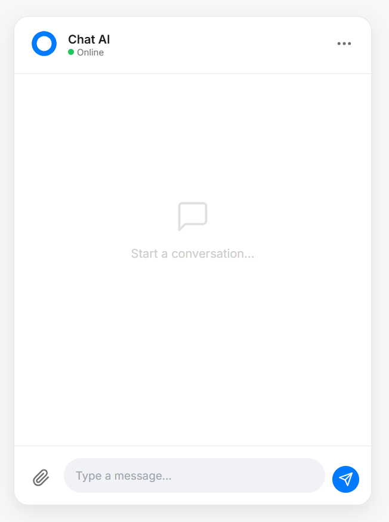

🤖 MY-FIRST-AI-CHATBOT
## 📸 Demo

  

This is an AI-powered chatbot built using LangChain and Ollama.
The chatbot can process and generate natural language responses efficiently. It is designed to be scalable, customizable, and easy to deploy across different environments.

With Docker integration, you can now run this project anywhere without worrying about installing Python, dependencies, or handling version conflicts.
🚀 Features

✅ AI-driven responses powered by LLMs

⚙️ Customizable design for various applications (customer support, automation, assistants)

⚡ Efficient performance using LangChain and Ollama integration

🔌 Easy to integrate into apps, APIs, or workflows

🧠 Context-aware replies with conversation memory

💽 Interactive CLI for chatting with the AI

🐳 Docker support for quick setup and portability

🌍 Cross-platform compatibility (Windows, Linux, MacOS)

📚 Project Overview

MY-FIRST-AI-CHATBOT is a minimal yet powerful AI chatbot that demonstrates how to:

Integrate LangChain with Ollama

Handle contextual conversations

Run in both local Python environments and Docker containers

Package and distribute AI projects easily via Docker Hub

The project started as a small experiment with LangChain & Ollama but was later containerized so that anyone can run it instantly on their machine.

🐳 Run with Docker (Recommended)

The easiest way to use this project is with Docker.
No need to install Python or dependencies manually.

1. Pull the Docker Image
docker pull debabrata7/my-first-ai-agent:latest

2. Run the Container
docker run -it debabrata7/my-first-ai-agent:latest

That’s it! 🎉 The chatbot will run instantly inside Docker.

⚠️ Important: You must have Ollama
 running locally (ollama run llama3) because the chatbot depends on the Ollama model.
